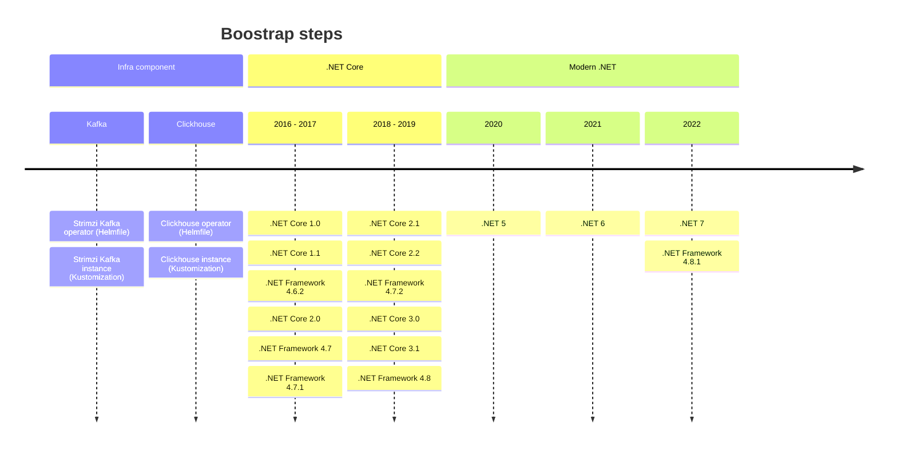

---

Use the timeline chart to see the actions to be taken 

## 1. Clickhouse

### 1.1 clickhouse-operator

https://github.com/Altinity/clickhouse-operator/blob/master/docs/operator_installation_details.md

### 2.1  clickhouse-instance