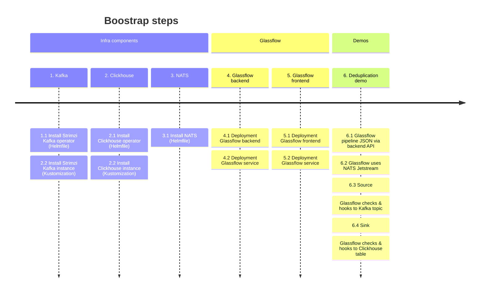

---

Use the timeline chart to see the actions to be taken 



---

## 1. Kafka
    
### 1.1 Strimzi Kafka operator
  
### 1.2  Strimzi Kafka instance

Kafka instance [manifest](k8s/strimzi-kafka/kafka-9d65.yaml)

### 1.3 Misc

Create the topic:

```sh
bin/kafka-topics.sh bin/kafka-topics.sh --bootstrap-server kafka-9d65-kafka-brokers.strimzi.svc.cluster.local:9092 --create --topic users --partitions 1 --replication-factor 1
```

Produce a message in the topic:

```sh
echo '{"event_id": "123", "user_id": "456", "name": "John Doe", "email": "john@example.com", "created_at": "2024-03-20T10:00:00Z"}' | bin/kafka-console-producer.sh --bootstrap-server kafka-9d65-kafka-brokers.strimzi.svc.cluster.local:9092 --topic users
```

Watch a topic: 

```sh
bin/kafka-console-consumer.sh --bootstrap-server kafka-9d65-kafka-brokers.strimzi.svc.cluster.local:9092 --topic user_events_with_duplicates
```

---

## 2. Clickhouse
  
### 2.1 clickhouse-operator
    
https://github.com/Altinity/clickhouse-operator/blob/master/docs/operator_installation_details.md
  
### 2.2  clickhouse-instance

### 2.3 Misc

```sh
clickhouse-chi-4782.clickhouse.svc.cluster.local
```

---

## 3. NATS
    
### 3.1 NATS installation


---

## Tools

- [Helmfile](https://github.com/helmfile/helmfile)