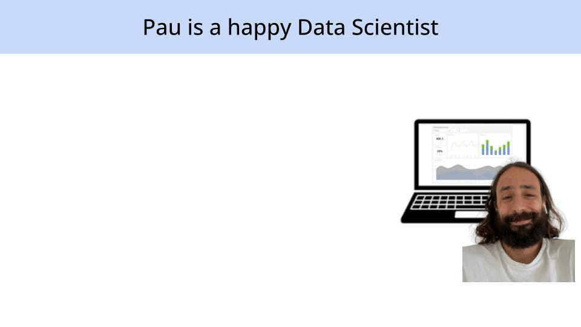
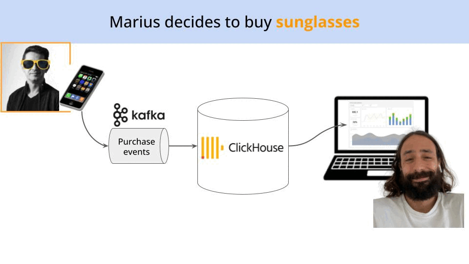
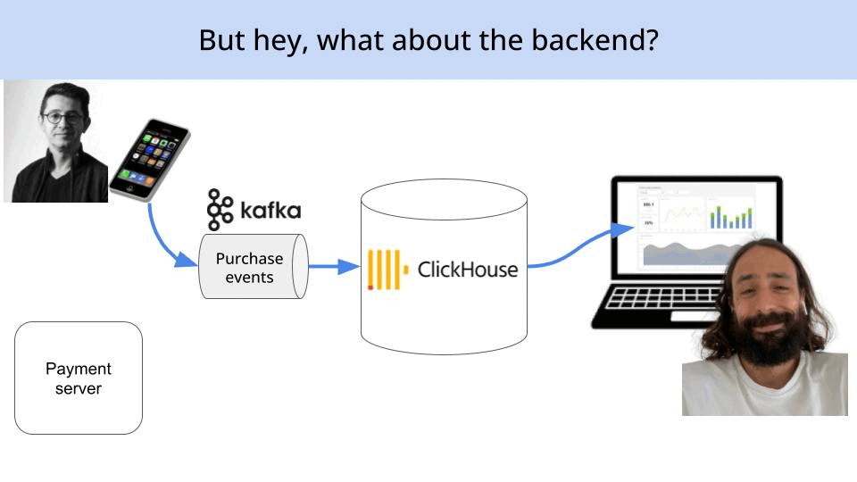
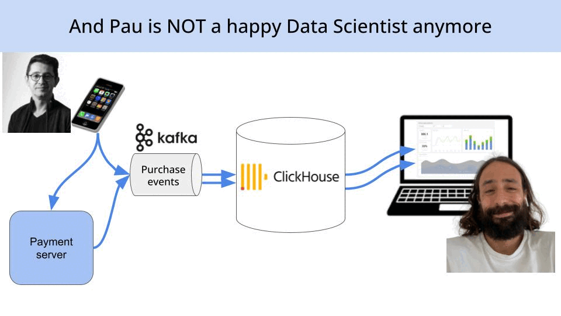
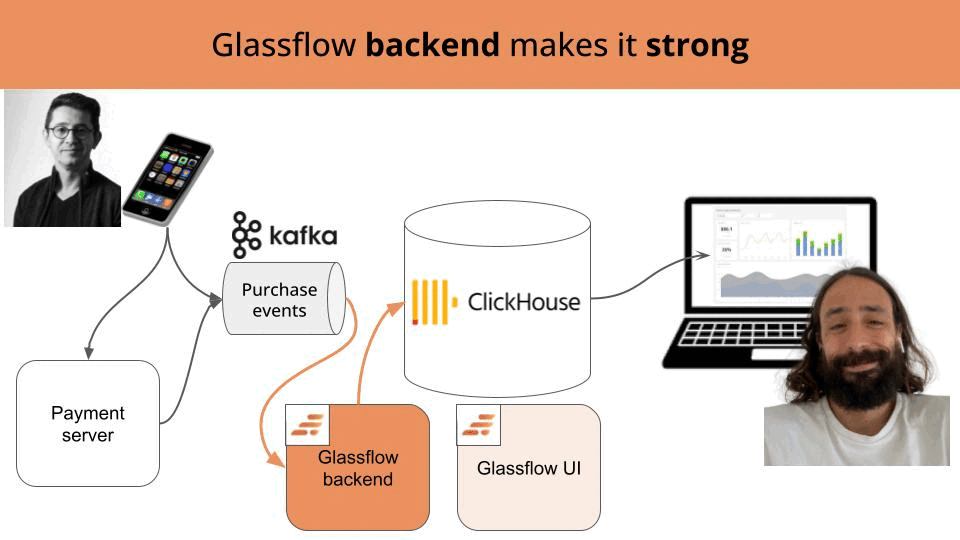

# The hidden nightmare of duplicates
## And how to fix it with Glassflow

Picture this:

You're a data scientist at a growing e-commerce company, and last Friday you launched an A/B
test on the checkout page. You worked for months designing this feature, that is being
finally tested.

After the weekend you go to the office on Monday, prepare yourself a coffe and go straight to your desk.
You open your dashboard with sales metrics, and you see that revenue has **doubled** since last week.

Woooow, what a way to start the week!

You are about to open the champagne...

...when your CEO comes in and asks the question:

> "How come are we selling double than last week?”

You are still in hype mode, so you start to explain the new data-driven design you followed 
with the art team to build a super intutive checkout experience, and bla bla bla bla.

The CEO is an old cat. So when results double so easily, she is not impressed. She is actually worried.

So, after 15 minutes of you trying to come up with a convincing explanation for your CEO, you
want to get to the root of the question, and query the database yourself.

The CEO is standing next to you, when you run...

```sql
SELECT user_id, timestamp, produt_id, amount FROM orders WHERE created_at > '2025-06-11' AND created_at < '2025-06-12';

user_id | timestamp             | product_id    | amount
123     | 2025-06-11 10:00:00   | ab56          | 100
123     | 2025-06-11 10:00:00   | ab56          | 100
456     | 2025-06-11 11:00:00   | 45ty          | 200
456     | 2025-06-11 11:00:00   | 45ty          | 200
```

Upsy daisy...

Cold sweat down your spine.. (feel free to swear if you feel like. I totally
recommend it).

...🤬🤬🤬🤬 DUPLICATES!!!!!

Now take a deep breath.

This is not a happy-go-merry-classroom-exercise. This is Real World Data/Science/ML/AI engineering, where 90% of the work is all about making sure the data is clean. And taking care of the duplicates is a big part of it.

> **Remember:**
>
> In the real world, duplicates are not the exception, they are the rule.

So today, you won't celebrate (yet). 

But you will learn some real world data engineering and get to know a new open-source tool that I have found, **[Glassflow](https://ishortn.ink/uMM9YxYpZPaujhz765GthkUlivThzUjsa)**, that helps you **deduplicate** (and join) data in real-time at scale. 

Let's start with the root of the problem.


## The Problem Nobody Talks About in university/courses/linkedin/X/whatever you are reading

In the real world, companies track everything. Every click, scroll, page visit, and purchase gets logged somewhere.

> **But, why do they do this?**
>
> Teams dump everything into Kafka topics, hoping they can "figure it out later" when they need to rerun analytics or swap out their database.
>
> Need to migrate from Postgres to ClickHouse? No problem—just spin up the new database and re-consume all that raw Kafka data.

But here's what nobody tells you: this data is **dirty as hell**.


## Example

Let's say that it is me, Pau Labarta Bajo, that happy data scientist who built a dashboard to track A/B test results.



Then, Marius Rugan, one of the most loyal customers in the company, opens up the app and buys himself a new pair of sunglasses (yellow ones, yes, because Marius is a crazy scientist, and crazy scientists have crazy tastes.)



His purchase event from the mobile app looks like this

```json
{
    "event": "purchase",
    "user_id": "123",
    "product_id": "ab56",
    "amount": 100,
    "timestamp": "2025-06-11 10:00:00".
    "_event_source_": "frontend-df342234"
}
```

and travels through the following steps:

- the mobile apps pushes this event into an internal **Kafka topic**
- the event goes into a table in the **Clickhouse database**, and
- the event shows up in the **dashboard that Pau built**, increasing sales by the purchase amount.

However, that is NOT the end of the story (I would not be telling all this if things
were so simple).

When Marius purchases his new (yellow) sunglasses, a second (server-side) event is generated from the the payment backend.

```json
{
    "event": "purchase",
    "user_id": "123",
    "product_id": "ab56",
    "amount": 100,
    "timestamp": "2025-06-11 10:00:00".
    "_event_source_": "backend-234aaf4"
}
```



> **Why is a second `purchase` event generated?**
>
> Because the payment backend is developed by the backend team, and you know backend guys are no
> big fans of communication, especially with the frontend team that develops the mobile
> app.
>
> So it often happens (like in this case) that they re-implement the same tracking logic on their super-fancy Java backend code.
>
> Hellooooo duplicateeees!


So, the new server-side event travels through the same steps:

- first to the **Kafka topic** for purchase events,
- then to the corresponding **Clickhouse table**, and
- finally hits (and destroys) the **dashboard**

And that makes Pau f****** miserable.



> **The crude truth**
>
> We have seen this problem in many companies we worked for over the years, where the same
> event gets recorded from multiple sources constantly.
> 
> For example:
>
> - **Frontend + Backend Tracking:** In gaming applications, client-side events fail 20% of the time. So engineering teams add redundancy with both client-side and server-side tracking. Developers love this approach—it's bulletproof from an engineering perspective. But for data scientists trying to make sense of the numbers? It's a nightmare.
>
> - **Cross-Service Communication:** Microservices architecture means the same user action might trigger events in multiple services, each dutifully logging to Kafka.
>
> - **Retry Logic:** When network calls fail, retry mechanisms can cause the same event to be recorded multiple times.
>
> The result? Your analytics database is full of duplicate events, inflated metrics, and impossible-to-trust dashboards.


Now, the problem of removing duplicates (aka deduplication) is not new.

So companies, have been trying to solve this problem for years.

But, how?


## The Traditional "Solutions" (And Why They Suck)

We have seen **two approaches** to solve the problem. Both of them look resonable at first glance, but they require either a heavy initial investiment of time and brainpower, a long-term operational cost, or both.

Let me explain.


### **Solution #1.** Create a custom deduplication service

Many companies try to solve the deduplication by plugging their Kafka topics into a
stateful streaming processor, like Apache Flink.

> **Why?**
>
> Because Kafka lacks native deduplication, requiring custom connectors with state management, like Apache Flink.


Adding a tool like Flink means extra operational complexity (non trivial DevOps work) and scaling challenges, often leading to fragile, hard-to-maintain systems.

Plus, I still haven't meet a data scientist in my life who enjoys writing Flink applications.


### **Solution #2.** Create a materialized view in your analytics database

Another option we have seen is creating a materialized view in your analytics database that clean up duplicates during ingestion.

The problem here is at least two-fold:

1. It is not clear who in the company owns the `materialized view`s. Is this data science? Is this data engineering?

2. Uncontrollable background merges on the DB that lead to wrong data until the merges are finished. So, if you need really real-time data, this is NOT real time. In terms of performance and scalability, materialized views can quickly become a bottleneck.

So you end up in a situation where:

- data scientists try to do data engieering work
- data engineers try to do data science work.
- plus, the ones doing the job are angry at the ones not doing the job, becuase no one likes this job.

So, having said all this, the next obvious question is:

> Is there a better way to deduplicate data in real-time at scale without adding operational complexity?

And you know what? I think there is.


## The Glassflow Solution

From a bird-eye view, adding Glassflow makes your system look like this:



Glassflow comes with 2 components:

1. A backend service (written in Golang) that does the heavy-lifting (deduplication and joining). It internally uses NATS for event streaming, which decouples the message ingestion from the processing, and makes it super scalable.

2. A frontend service (UI) that data scientists like Pau can use to configure the deduplicaton rules and build robust "deduplication pipelines".


> **Tip** 💡
>
> The Glassflow backend also exposes a REST API, that you can interact to programatically using for example Python. So, you can also publish and version-control your pipeline definitions. Which is, by the way, a great idea.

## The Testing Setup

> All the code and instructions necessary to run these experiments are available in
> [this Github repository](https://github.com/Real-World-ML/glassflow-demo).

This is engineering, not religion, ok?
We won't say that tool A is better than tool B, just because "that's the way it is".

Instead, we will take `Glassflow` for a spin, and see how it performs in a real-world scenario. This is what Marius Rugan and I did and what I show you here.

> Who is Marius Rugan? 🕶️
>
> Besides a crazy-yellow-sunglasses-wearing scientist, Marius Rugan is also a world class infrastructure engineer. He also happens to be one of the most active and productive members in the Real World ML Comunity, and a person who is constantly researching and testing production-grade solutions.
> 
> This is what he does for a living, what he teaches with me at the Real World ML Community, and what he wants to (I assume, I did not really ask him direcly) trasmit here in this blog post. He is probably walking his dog Bruno at the moment somewhere in the forest in the outskirts of Amsterdam. If you see him, say hi!

Ok, back to the test, let me show you what we did.


> **Attention** ⚠️
>
> What we are testing here is not 10-year old, established and super-polished product. Glassflow is a very young product, actively being developed by a few super-talented data engineers based in Berlin.
> Which means that, while I am writing this blog post (and probably while you read it), they are actively developing to make it super easy for you to test and run in your own cluster.
> If you have any feedback and/or problems while trying to run it yourself, open an issue [on their Github repository](https://ishortn.ink/uMM9YxYpZPaujhz765GthkUlivThzUjsa).


### Step 1. Set up your Kubernetes cluster

The Kubernetes cluster that Marius created is something that is more than sufficient for most mid-size companies.

- 3 nodes with 128GB RAM each, capable of processing at least 5,000 events per second.

> **Why did we go bare-metal instead of cloud?**
>
> Simple: cost and performance. Marius found rental machines that gave us the power we needed without cloud provider overhead, that together with Talos, give you a super-lightweight Kubernetes cluster.
> Yes, he's a bit of a mad scientist, I told you.

### Step 2. Deploy the stack of services

The stack we deployed in the Kubernetes cluster includes:

- **Kafka (via Strimzi)** for event streaming
- **ClickHouse** as our analytical database
- **Glassflow** backend service writen in Golang, for real-time data deduplication, plus the Glassflow UI.
- **NATS** for event streaming, used by the Glasflow backend to decouple ingestion from processing, and making the tool more scalable.

You can install all these services using the helmfiles we provide in our [Github repo](https://github.com/Real-World-ML/glassflow-demo).


### Step 3. Run your first deduplication test

To run the deduplication test, we took [this Python script](https://github.com/glassflow/clickhouse-etl/blob/main/demos/demo_deduplication.py) the Glassflow team shares in their official repo, and ran it as a standalone pod inside our Kubernetes cluster.

To do so, we followed these steps:

1. Start a devcontainer inside Kubernetes with a minimal Python environment
2. `kubectl exec` into the container
3. Git clone the Glassflow repository inside the running container.
4. Bootstrap the Python virtual environment and install the dependencies with `pip install -r requirements.txt`
5. Tweak the configuration yaml of the pipeline, to point to the right Kafka and Clickhouse instances in your cluster.
6. Run the script with `python demo_deduplication.py`

We ran 2 tests.

- **Mid-size** test, with a total of 10,000 events emmited at a rate of 1,000 events per second (which means events are streaming for 10 seconds)
    ```sh
    python3 demo_deduplication.py --events 10000 --rps 1000
    ```
    Took 19 seconds to deduplicate the events with zero errors.

- **Large-size test**, with a total of 300,000 events emmited at a rate of 3,000 events per second (which means events are streaming for 100 seconds)
    ```sh
    python3 demo_deduplication.py --events 300000 --rps 3000
    ```
    Took 204 seconds to deduplicate the events with some errors. Our hypothesis here is that operation actually worked, but the errors come from a bug in our testing setup.


In terms of memory usage in the cluster, we never went beyond 10%, which is GREAT.


### Beyond Deduplication: Real-Time Joins

In production systems, you're not just dealing with duplicates. You're joining data streams in real-time—user profiles with purchase events, session data with conversion metrics, behavioral data with demographic information.

These are tests we still did not run, but we plan to do so in the future. All the progress and results will be shared in our [Github repository](https://github.com/Real-World-ML/glassflow-demo).


## Time to wrap up

Data duplication isn't a theoretical problem—it's a daily reality that's quietly destroying the accuracy of your analytics. 

Traditional solutions with materialized views create more problems than they solve, leaving your team caught between database administration and data science.

Today we explored one (if not the most) promising open-source tool we know of to make real-time data deduplication and joining at scale a thing from the past.

It is called [Glassflow](https://ishortn.ink/uMM9YxYpZPaujhz765GthkUlivThzUjsa), and it is open-source.

If you are interested in trying it out, I suggest you

- Go to their [Github repo](https://ishortn.ink/uMM9YxYpZPaujhz765GthkUlivThzUjsa) to familiarize yourself with the tool.
- Support them by starring their repository
- And try the experiment Marius and I have been running.

And if you have any feedback, please share it with the Glassflow team by opening a Pull Request or an Issue in their [Github repository](https://ishortn.ink/uMM9YxYpZPaujhz765GthkUlivThzUjsa).

Talk to you next week,

Enjoy the weekend,

Pau